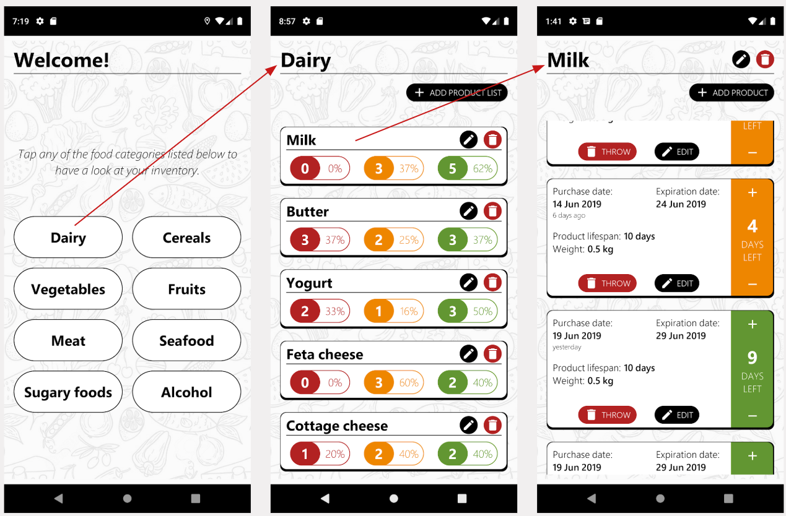

# CutScad

CutScad is an app that aims at reducing food waste. It is a digital inventory of the user's fridge, keeping track of the
quantities and the expected expiry dates, both inputted by the user. Each product is labeled with a color indicating its
freshness and the app notifies about soon-to-expire items.

The development of CutScad was part of the course _User testing, evaluation, and improvement_ at the
[Eindhoven University of Technology](https://www.tue.nl/en/).

The following image shows part of the UI and user flow of the app.

